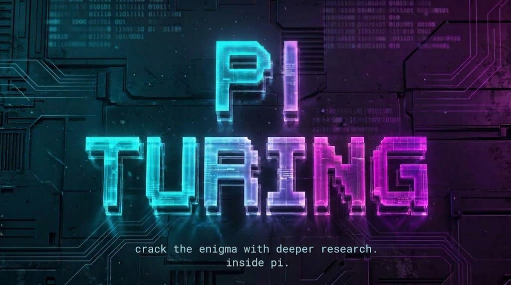
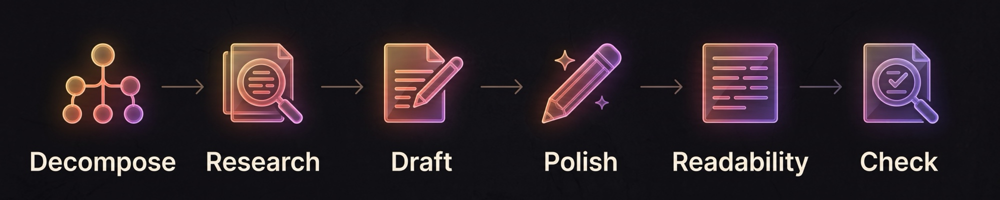

# Turing

[](https://github.com/javiermolinar/pi-turing/actions/workflows/ci.yml)
[](https://github.com/javiermolinar/pi-turing/releases)
[](https://pi.dev)
[](#install-in-pi)
[](LICENSE)
[](#what-is-it)



> "We can only see a short distance ahead, but we can see plenty there that needs to be done."
>
> — Alan Turing

Turing (`pi-turing`) is a research workspace for [Pi](https://pi.dev), inspired by [Hyperresearch](https://github.com/jordan-gibbs/hyperresearch) by Jordan Gibbs.

## What is it?

A research toolkit that searches the web and scholarly literature, reads sources, and turns your question into a report with citations. It uses the model you select in Pi.


- **Native TypeScript.** Runs directly in Pi on Node.js—no Python, uv, or separate backend setup.
- **Choose your sources.** Web search through DuckDuckGo, Brave, Tavily, Serply, or Kagi, plus scholarly discovery through OpenAlex, Crossref, and opt-in specialist providers.
- **Keep working.** Start research in the background without locking your Pi prompt.
- **Follow the work.** See progress, sources, and estimated cost in a live dashboard.
- **Change direction.** Steer a running investigation, pause and resume, or revise a finished report.
- **Take the report with you.** Export Markdown or self-contained HTML you can read offline.



Experimental. Reports can contain factual errors; citations and automated checks are not a guarantee of accuracy.

## Install in Pi

Requires **Node.js 22.13+** and **[Pi](https://pi.dev) with a configured model**.

Install directly from GitHub:

```bash
pi install https://github.com/javiermolinar/pi-turing.git
```

Pi installs the package and its dependencies. Start Pi, or run `/reload` in an existing session when research is idle.

### Update

Pause any active research, then run:

```bash
pi update https://github.com/javiermolinar/pi-turing.git
```

Run `/reload` in Pi to load the update. Saved investigations remain intact.

<details>
<summary>Upgrading from pi-hyperresearch</summary>

No data migration is needed. `/hyperresearch` remains an alias for `/turing`; the tool is now `turing_run`. Use `.pi/turing.json` for new configuration; `.pi/hyperresearch.json` still works when the new file is absent. Storage remains at `~/.pi/hyperresearch`. `TURING_DATA_ROOT` and `TURING_CONTACT_EMAIL` take precedence over their legacy `HYPERRESEARCH_*` equivalents. If you installed from the old repository, pause research and use `pi list` to find that package, then `pi remove <old-source>` before installing from the new URL above. This avoids loading both packages; removing the package does not delete saved investigations.

</details>

### Search providers

**DuckDuckGo is the default: free, with no API key. It can be rate-limited or blocked by bot challenges.** To use another provider:

| Provider | `searchProvider` | API key variable |
| --- | --- | --- |
| DuckDuckGo (default) | `duckduckgo` | None |
| [Brave](https://brave.com/search/api/) | `brave` | `BRAVE_SEARCH_API_KEY` |
| [Tavily](https://www.tavily.com/) | `tavily` | `TAVILY_API_KEY` |
| [Serply](https://serply.io/) — Google results | `serply` | `SERPLY_API_KEY` |
| [Kagi](https://kagi.com/api) | `kagi` | `KAGI_API_KEY` |

For example, select Kagi in your project's `.pi/turing.json`:

```json
{ "searchProvider": "kagi" }
```

Set its key in your shell and launch Pi:

```bash
export KAGI_API_KEY="your-key"
pi
```

Saved runs retain their original provider. Search failures never trigger an automatic switch to another service.

Scholarly search defaults to OpenAlex and Crossref. If you customize `scholarlyProviders`, keep `openalex`: light research requires it for the final retraction refresh. Incompatible settings are rejected before research starts.

## Use it

### Ask a question

```text
/turing Compare SQLite and PostgreSQL for a small local research vault.
```

Approve the cost confirmation and let it run. Research can take **30+ minutes**. The default model-cost ceiling is **approximately $15**, not a price estimate or a hard billing cap; in-flight calls can exceed it, and search fees are separate.

- **Follow and steer:** open `/turing` to watch progress, inspect sources, and guide the investigation from the box beside the report.
- **Go deeper:** ask a follow-up in the dashboard to start a new paid investigation linked to the original. The original report stays unchanged.
- **Come back later:** run `/turing` in Pi to browse saved investigations and export reports as Markdown or offline HTML.

## Compared with upstream

We target [Hyperresearch](https://github.com/jordan-gibbs/hyperresearch)’s **light research workflow**, not full feature parity.

- **Shared workflow:** planning, source research, one draft, polish, readability, and structural/quote checks.
- **Adapted for Pi:** a native TypeScript runtime, background workers, a live dashboard, steering, and linked follow-ups with explicit spending and private-context permissions.
- **Not included:** broader research tiers, knowledge-base management, browser automation, and OCR.

From upstream’s 16-step pipeline, Pi adapts steps **1, 2, 10, 15, and 16**. The main gaps are:

- **Steps 3–9:** contradiction analysis, targeted depth research, reconciliation of source disagreements, corpus critique, and evidence digests.
- **Steps 10–11:** multiple drafts and synthesis; Pi currently produces one draft.
- **Steps 12–14:** dedicated critic reviews, targeted gap-filling research, and critic-driven revision.

---

[MIT License](LICENSE) · [Upstream attribution](THIRD_PARTY_NOTICES.md)
